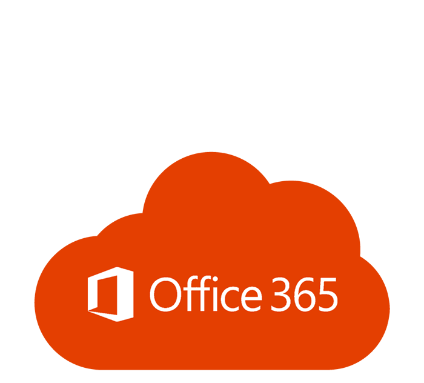

### Hi there 👋, i'm CHANDAN KORTEKAR
#### a WEB DEVELOPER
 Seeking a position that offers opportunities for personal and professional development in software engineering field

- 🔭 I worked as an associate engineer trainee in PARVAM consult-tech pvt lmt 
- 🌱 I’m currently learning React'js 
- 💬 Ask me about WEB  
- 📫 How to reach me: ckortekar93@gmail.com  // kortekardot30@gmail.com  // +91-7406244916
- Portfolio -- <a href="https://kortekar.github.io/portfolio/" target="_blank"> CLICK HERE </a>

<h3 align="left">Languages and Tools:</h3>

  &nbsp;
  &nbsp;
  &nbsp;
  &nbsp;
  &nbsp;
  &nbsp;
  &nbsp;
  &nbsp;
  &nbsp;
  &nbsp;
  &nbsp;
  &nbsp;
  &nbsp;
  &nbsp;
  &nbsp;
  &nbsp;
  &nbsp;

   

  

          

