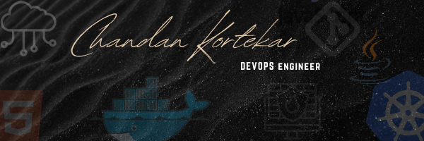

# Hi there 👋, i'm CHANDAN KORTEKAR

###### i was a WEB DEVELOPER 🖥️
### Now I'm working as DEVOPS ENGINEER🤞🏻

- Currently Working💻 in an startup 👍 as a Devops Engineer 
- 🛠️ I worked as an associate engineer trainee in PARVAM consult-tech pvt lmt 
- 📚 I’m currently learning so many things❤️‍🔥
- 💬 Ask me about WEB, Devops( Docker , Jenkins , Kubernetes , gradle , GCP , Git / Gitlab , Java , Springboot , Postgress , Terraforms , Junit , Linux ) 
- 📫 How to reach me: ckortekar93@gmail.com  // kortekardot30@gmail.com  // +91-7406244916
- Portfolio -- <a href="https://kortekar.github.io/portfolio/" target="_blank"> CLICK HERE </a>
 # Tutorials ✍🏻 📝
 #### only for me🔪 but... it's OK ❤️‍🩹
 ### ✅ DSA : <a href="https://github.com/kortekar/Problems" target="_blank"> Click_here</a>
 ### ✅ Docker : <a href ="https://github.com/kortekar/Docker_files" target="_blank"> Click_here </a>
 ### ✅ Jenkins : <a href ="https://github.com/kortekar/Jenkins" target="_blank"> Click_here</a>
 ### ✅ Terraforms : <a href ="https://github.com/kortekar/Terraforms" target="_blank"> Click_here </a>
 ### ✅ Medium_website_profile : <a href ="https://medium.com/@kortekar" target = "_blank"> Click_here </a>
 ### ✅ Gitlab_cloning_problems : <a href="https://github.com/kortekar/Jenkins" target="_blank"> Click_here</a>
 ### ✅ DevOps_interview_question : <a href = "https://github.com/kortekar/devops_interview_questions" target="_blank"> Click_here</a>

# 
<h3 align="left">Connect with me:💞 </h3>

# <h3 align="left">Languages and Tools 🛠️ :</h3>

 <a href="https://developer.mozilla.org/en-US/docs/Web/JavaScript" target="_blank" rel="noreferrer">   
   
 
      </a> 
  
       
   
   
  
 

Some Badges ( To be Frank I don't Know what they are 🤷🏻‍♂️): 

 

  

          

